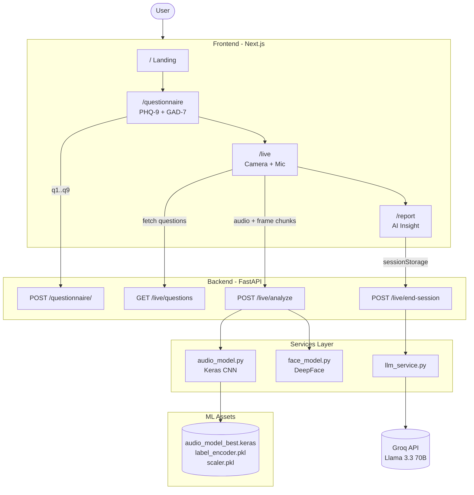

# Lumina — Multimodal Psychological Screening System

A private, AI-guided wellness screening that combines clinical questionnaires (PHQ-9, GAD-7) with real-time voice and facial emotion analysis. The system fuses three signals into a unified emotional resilience report generated by an LLM.

---

## Architecture



---

## Tech Stack

**Frontend:** Next.js 16 (App Router) · React 19 · TypeScript · Tailwind CSS 4 · Stitches
**Backend:** FastAPI · Python 3.10 · TensorFlow / Keras · Librosa · OpenCV · DeepFace
**LLM:** Groq API (Llama 3.3 70B Versatile)

---

## Setup

### Prerequisites
- Python 3.10+
- Node.js 18+
- Groq API key

### 1. Clone the repo
```bash
git clone https://github.com/Abhi03057/Multimodal-Psychological-Screening-System
cd Multimodal-Psychological-Screening-System
```

### 2. Get the model files (not in git)
The trained ML models are too large for GitHub. Get `models.zip` from the project owner and extract it into `backend/models/`. You should end up with:
```
backend/models/audio_model_best.keras
backend/models/label_encoder.pkl
backend/models/scaler.pkl
```

### 3. Create `.env` in the repo root
```
GROK_API_KEY = "your_groq_api_key_here"
```

### 4. Backend
```bash
cd backend
python -m venv venv
venv\Scripts\activate          # Windows
# source venv/bin/activate     # macOS / Linux
pip install -r requirements.txt
```

### 5. Frontend
```bash
cd ../frontend
npm install
```

---

## Running

**Terminal 1 — Backend**
```bash
cd backend
venv\Scripts\activate
python -m uvicorn main:app --reload --port 8000
```

**Terminal 2 — Frontend**
```bash
cd frontend
npm run dev
```

Open **http://localhost:3000**

---

## User Journey

1. **Landing** — Overview of the screening process
2. **Questionnaire** — PHQ-9 (9 depression items) and GAD-7 (7 anxiety items)
3. **Live Session** — Guided 4-question interview with real-time voice and facial analysis (5-second chunks)
4. **Report** — AI-generated wellness narrative combining all three modalities

---

## API Endpoints

| Method | Endpoint | Purpose |
|--------|----------|---------|
| `POST` | `/questionnaire/` | Submit PHQ-9 answers, returns total score |
| `GET`  | `/live/questions` | Fetch the 4 guided session prompts |
| `POST` | `/live/analyze` | Process one audio + frame chunk |
| `POST` | `/live/end-session` | Aggregate session data, generate LLM report |

---

## Disclaimer

This is an automated screening tool and does **not** constitute a medical or clinical diagnosis. Results should be interpreted by a qualified mental health professional.